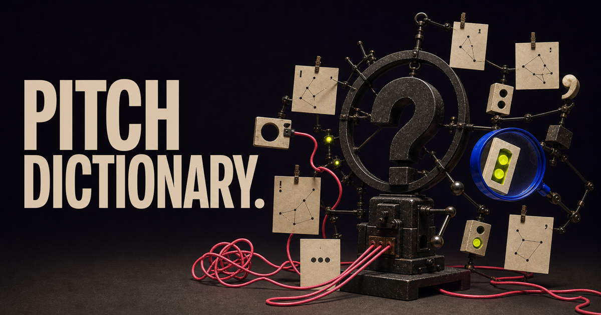
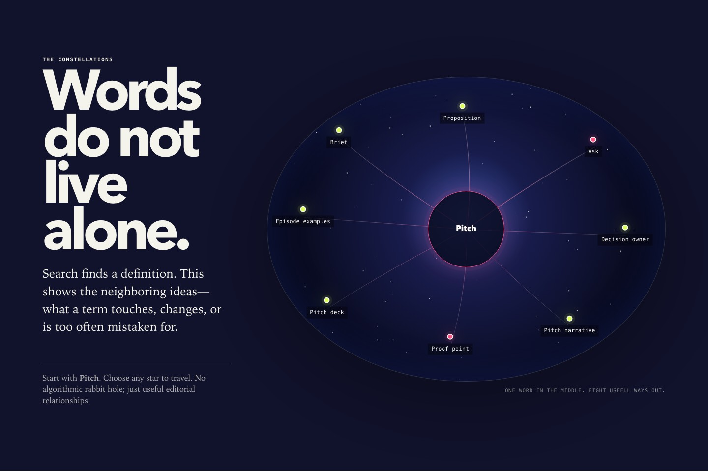

<p align="center">
  
</p>

# Pitch Dictionary

**[Open the live tool](https://pitchdog-pitch-dictionary.dog-pitch.chatgpt.site)**

**Clear the doubt. Keep your place.**

A local-first dictionary for pitch work: 187 plain-English terms, forgiving fuzzy search, useful context, and a celestial map of related ideas.

[](https://github.com/bomkino/pitchdog-pitch-dictionary/actions/workflows/ci.yml)

<p align="center">
  
</p>

## Search like a person

Search by term, acronym, meaning, alias, or a reasonable misspelling. Filters cover eight practical families: foundations, story and form, people and route, deck craft, delivery and access, evidence and money, production and rights, and process.

Results explain:

- what the term means in plain English;
- why it matters;
- what it changes in the work;
- nearby ideas and common confusions.

## Constellations, not a thesaurus dump

Open any term to see a deterministic map of related concepts. Nodes are real buttons, relationships are also listed in text, the dialog resets cleanly when you travel, and reduced-motion users get the same information without parallax.

The opening word field uses Matter.js physics. The constellation uses a light canvas layer plus semantic HTML. Neither is a decorative loading screen; both lead into the dictionary.

## Local by design

Search and term data run entirely in the browser. No runtime AI, account, database, analytics, upload, remote font, or email gate.

## Run and verify

Requires Node.js 22.18 or newer.

```bash
npm install
npm run dev
npm run verify
```

`npm run verify` runs TypeScript checks, term/search/constellation tests, the production build, and hosting-contract tests.

## How it is built

- `src/terms.ts` — the public 187-term editorial registry
- `src/search.ts` — deterministic fuzzy ranking
- `src/constellation.ts` — related-term scoring and node layout
- `src/physics.ts` — reduced-motion-aware opening field
- `src/main.ts` — search, categories, pagination, dialog, and navigation
- `tests/` — search, registry, constellation, and hosting contracts
- `docs/PRODUCT-CONTRACT.md` — editorial and technical boundaries

## Contributing and reuse

New terms, clearer definitions, missing aliases, better relationships, localization work, and accessibility fixes are welcome. Read [CONTRIBUTING.md](CONTRIBUTING.md), [CODE_OF_CONDUCT.md](CODE_OF_CONDUCT.md), and [SECURITY.md](SECURITY.md).

Software and documentation: [AGPL-3.0-or-later](LICENSE). Original visual assets: [CC BY-SA 4.0](ASSET-LICENSE.md). The pitch.dog name and logo remain subject to [TRADEMARKS.md](TRADEMARKS.md).
